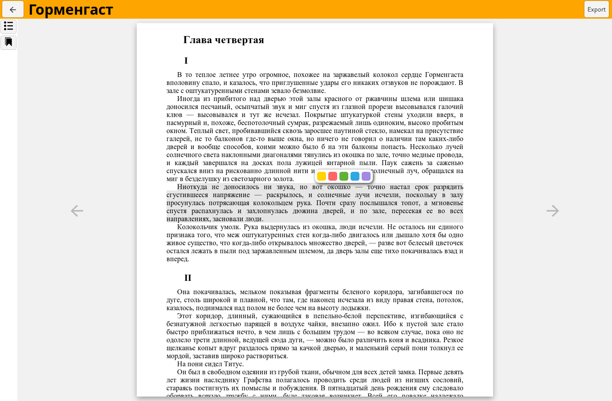

# Moon Quote

EPUB citation manager



## Installation

Debian and Windows versions should work out of the box.

_Note that you'll have to delete the library folder before migrating to v.0.2.0+_ 
_from the early development versions_
The library is located at:

- `%APPDATA%\com.snorkysnark.moon-quote` on Windows
- `~/.local/share/com.snorkysnark.moon-quote` on Linux

### Appimage

If you are using the Appimage or a version compiled from source,
you'll need to register it as a handler for `moonquote:///` urls.
To do that, create the following .desktop file inside `~/.local/share/applications`,
replacing `{{exec}}` with the executable path:

```
[Desktop Entry]
Categories=Development;
Exec={{exec}} %u
Icon=moon-quote
Name=moon-quote
Terminal=false
Type=Application
MimeType=x-scheme-handler/moonquote
```


---
Icons: Free icon pack by https://icomoon.io/
